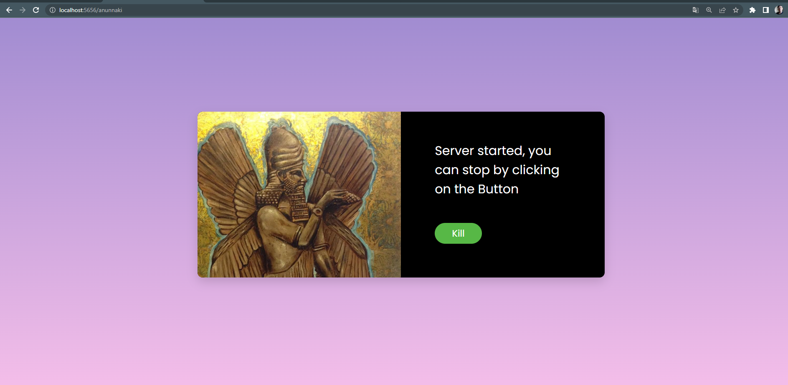

# CVE-2022-30190

[](https://nodesource.com/products/nsolid)

## Concept

Follina represents a critical security vulnerability uncovered within Microsoft Office products, exposing them to potential remote code execution (RCE) attacks. Microsoft has issued security updates to address the Follina vulnerability, but numerous unpatched versions of Microsoft Office remain susceptible. Follina has been assigned the Common Vulnerabilities and Exposures (CVE) number CVE-2022-30190 for tracking purposes by NIST.

Threat actors exploit Follina through phishing campaigns, tricking targeted users into opening Office documents with malicious web-links leading to attacker-controlled online resources. These embedded links exploit the "Microsoft Support Diagnostic Tool" (MSDT) protocol, which is typically used for system crash reporting but can be manipulated to execute attacker-supplied PowerShell commands without user interaction.

The Follina exploit can be triggered when a user opens a Microsoft Office document containing malware delivered via email, online channels, or even through USB devices. Notably, the malicious code could execute via the Preview Tab in Explorer if the file is in .rtf format, even without direct user interaction. The malware payload is activated through the MSDT protocol.

Follina was first revealed as a zero-day vulnerability on May 27, 2022, in a tweet by @nas_sec. Security researchers detected the first recorded malware sample exploiting Follina on April 7, 2022, though it is believed that the flaw was exploited earlier. Subsequently, cybersecurity researchers noticed a surge in phishing campaigns using Follina in attachments, and the vulnerability continues to pose a significant threat to unpatched systems targeted in phishing attacks.

## Demonstration
This platform serves as the principal platform for my exploit. I will enter my LAN IP and the shell code containing the "start calc.exe" command.


Now we can see that our server is in listening mode.


Here is our doc file.


We can observe the shell execution of the calculator when I started my doc file.


## ATTENTION
I have not managed INPUT errors, so please be cautious when providing information on the HTML platform.

## Requirement
- You need to have Maven installed on the PATH variable to use this software.
- JDK 16.0.2

## Installation
### Windows
- To install, download JDK 16.0.2, and then add the bin file to the path.
- Download the Maven zip version, and then add the bin execution of Maven to the environment variable.

### Linux
- Download JDK 16.0.2:
```sh
sudo unzip jdk****.zip
sudo dpkg -i jdk****.deb
sudo export PATH="/usr/lib/jvm/jdk-16.0.2/bin:$PATH"
sudo apt-get install maven
```
#####  Installation of Software
#
```sh
cd Annunaki
mvn spring-boot:run
```
##### Execution
#
>Browse on Browser link : http://localhost:5656/anunnaki
